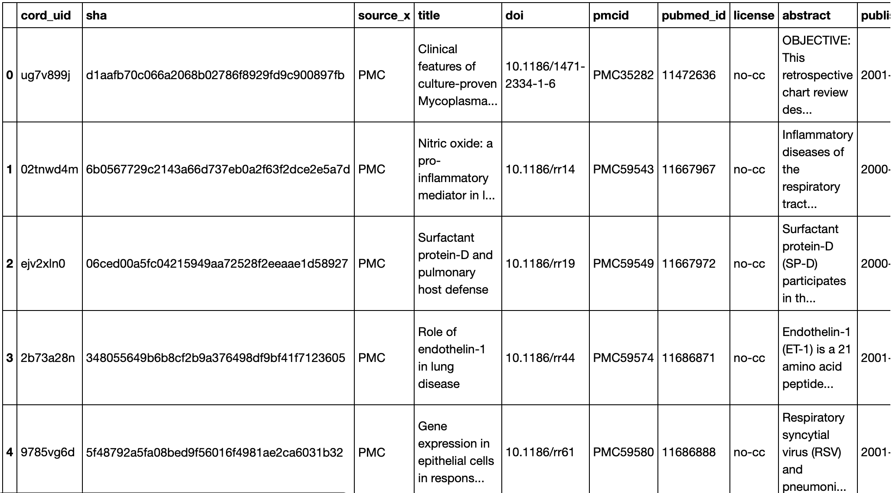
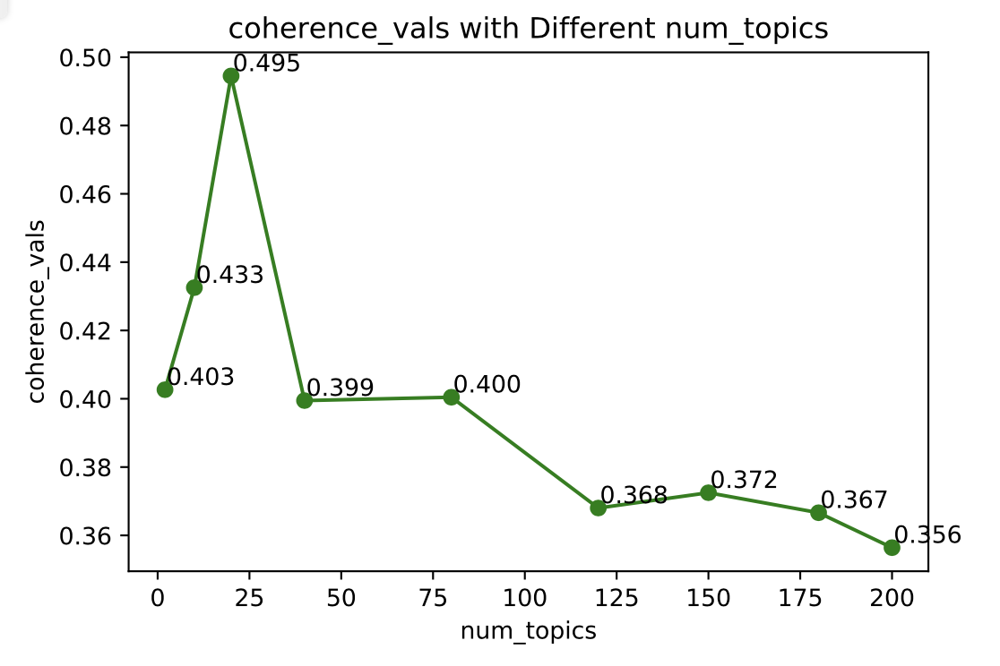
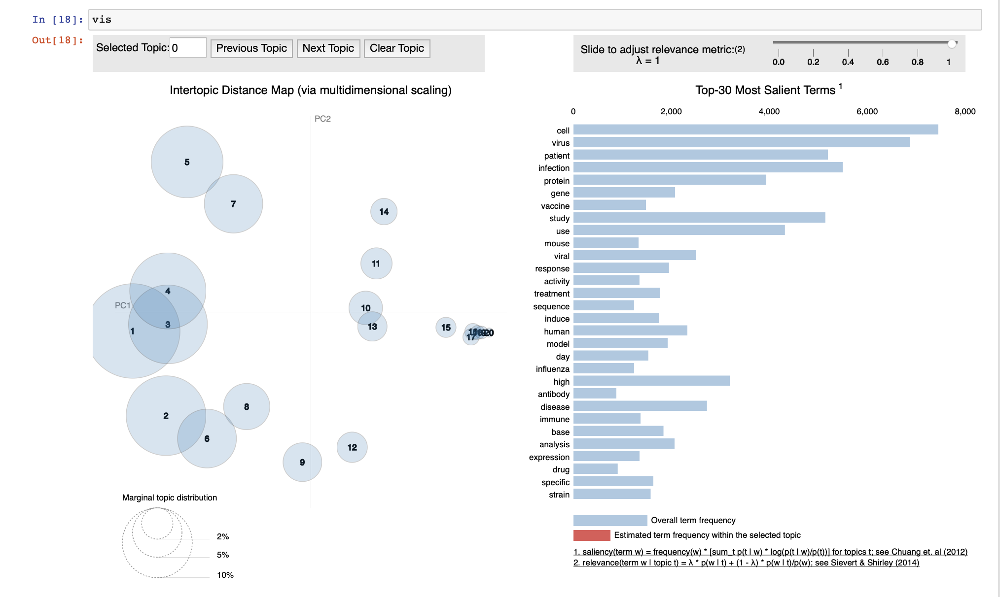
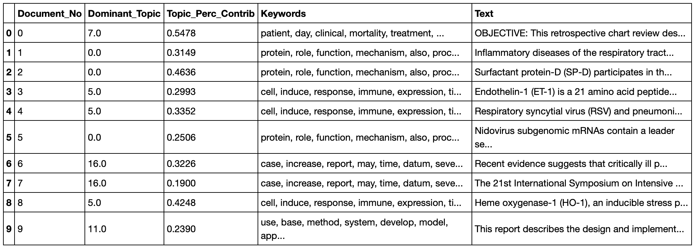
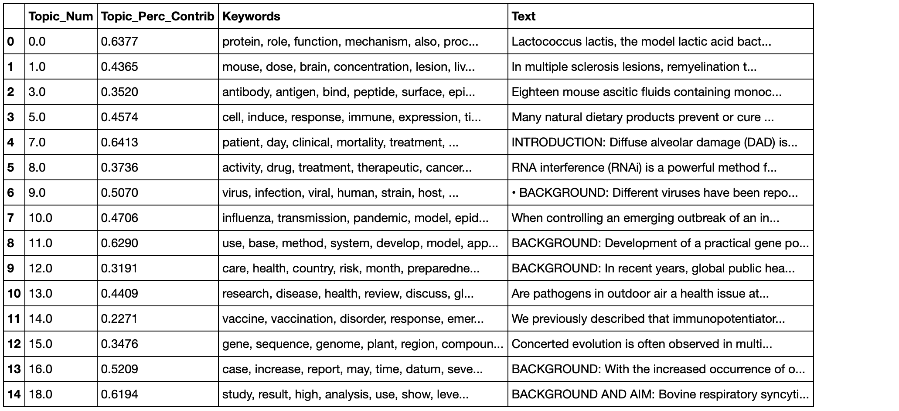

# Topic Modelling of COVID_19 and Related Coronaviruses Articles

COVID_19 is a pandemic that shocked people around the world in 2020. In order to help humans overcome the disease, researchers in the field of research related to this disease have published many scientific research articles on the disease and its related diseases on the Internet. Due to the large number of articles, how to effectively classify articles and help others to search effectively is also an important technical content. For this reason, the main function of this project is to extract effective information from the abstracts of many scientific research articles and classify the topics of the articles. Over 5000 scholarly articles from the COVID-19 Open Research Dataset are performed topic modeling and LDA models were created to analyze 20 topics that could be identified from just the articles’ abstract or introduction and conclusion. 

## Data Source

The corpus was obtained from the COVID-19 Open Research Dataset and consisted of over 200,000 scholarly articles, 100,000 of which were full-text papers related  to coronaviruses, stored in JSON format (AI, 2020). The project only interested in the 85,059 PubMed Central articles as a subset of the scholarly articles available. Of these documents, 5000 were selected at random to create a randomized subset of documents.

- Use the link below to visit the data source:

[COVID-19 Open Research Dataset Challenge (CORD-19)](https://www.kaggle.com/allen-institute-for-ai/CORD-19-research-challenge)

- Sample of data after cleaning

## Gensim LDA Models

Genisim is a popular open source library, for Python and other programming languages, that can be used for unsupervised topic modelling using Latent Dirichlet Allocation (LDA). Nine models based on the number of different topics were established to explore whether the number of topics is the best number. These topic numbers are: 2, 10, 20, 40, 80, 120, 150, 180, 200. The coherence score is used to judge the performance of the model. It ranges from 0 to 1, the higher the score the better the topic number choice is. 

The highest score is 0.495 for 20 topics.

## Result
- Visualization of the topicskeywords

- Result of abstract text with dominant topic number, topic percent contribution, and keywords

- Result of the most representative document for each topic

